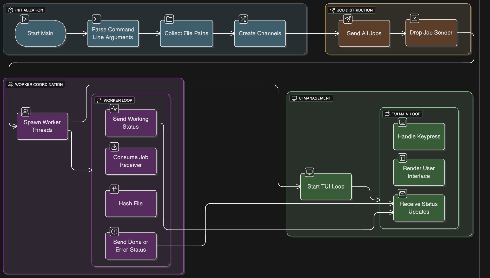

```
███████╗██╗██╗     ███████╗██████╗ ██╗ ██████╗ ███████╗███████╗████████╗
██╔════╝██║██║     ██╔════╝██╔══██╗██║██╔════╝ ██╔════╝██╔════╝╚══██╔══╝
█████╗  ██║██║     █████╗  ██║  ██║██║██║  ███╗█████╗  ███████╗   ██║   
██╔══╝  ██║██║     ██╔══╝  ██║  ██║██║██║   ██║██╔══╝  ╚════██║   ██║   
██║     ██║███████╗███████╗██████╔╝██║╚██████╔╝███████╗███████║   ██║   
╚═╝     ╚═╝╚══════╝╚══════╝╚═════╝ ╚═╝ ╚═════╝ ╚══════╝╚══════╝   ╚═╝   
```

# 🖇️ FileDigest – Multithreaded CLI with TUI

A high-performance, multithreaded file hasher written in Rust, featuring a **terminal user interface (TUI)** for real-time progress monitoring. Supports recursive directory traversal, multiple hashing threads, and error reporting.

---

## 📌 Features

- **Multithreaded hashing**: Utilizes multiple threads to hash files concurrently.
- **Recursive directory traversal**: Automatically discover files in directories, with optional recursion.
- **TUI for progress monitoring**: Interactive terminal UI showing file status (pending, working, done, error).
- **Robust error handling**: Gracefully handles IO errors and invalid paths.
- **Cross-platform**: Works on Linux, macOS, and Windows.
- **Configurable threads**: Specify the number of worker threads at runtime.

---

## 🏗️ Architecture / Flow Diagram



The general flow of the application:

1. **CLI Parsing**
   - Accept files or directories
   - Accept number of threads and recursion flag

2. **File Collection**
   - Recursively traverse directories (if enabled)
   - Build a list of files to hash

3. **Worker Pool**
   - Spawn configurable number of threads
   - Each thread reads files and computes BLAKE3 hash
   - Send status updates back to main thread

4. **Status Updates / TUI**
   - Main thread receives status updates
   - Updates the terminal UI in real-time
   - Shows Pending, Working, Done, and Error states

5. **Completion**
   - All threads finish
   - UI exits gracefully
   - Hash results are available for use

---

## ⚙️ CLI Usage


file-hasher [OPTIONS] <inputs>...

Options

Flag	Description	Default
-t, --threads	Number of worker threads	Number of CPU cores
-r, --recursive	Recursively traverse directories	true
-h, --help	Show help message	-

Example

# Hash a single file
file-hasher ./example.txt

# Hash all files in a directory recursively using 4 threads
file-hasher ./my_folder -r -t 4


⸻

## 🧩 Code Structure

src/
├── main.rs         # Entry point, CLI parsing & TUI loop
├── lib.rs          # Library exposing core logic
├── cli.rs          # CLI definition using clap
├── file_hash.rs    # File hashing logic (BLAKE3)
├── jobs.rs         # Worker thread logic, job queue, file collection
├── tui.rs          # Terminal UI rendering
├── utils.rs        # Helper functions (e.g., string truncation)
└── error.rs        # Custom error types

	•	lib.rs exposes core functions for testing and integration.
	•	Modular design separates logic from UI for maintainability.

⸻

## 🧪 Running Tests
	•	Unit tests: Run all internal module tests

cargo test

	•	Integration tests: Tests file hashing, path collection, and error handling

cargo test --test integration_tests

	•	Temporary files: Integration tests use tempfile crate to avoid polluting filesystem.

⸻

## 🔧 Dependencies
	•	blake3 – Fast cryptographic hashing
	•	crossbeam_channel – Multithreaded communication
	•	walkdir – Recursive directory traversal
	•	ratatui – Terminal UI rendering
	•	crossterm – Terminal input/output
	•	clap – CLI argument parsing
	•	anyhow – Error handling
	•	tempfile – Temporary files for tests

⸻

## 🧭 Next Steps / TODO
	•	Add hash verification or checksum output to file
	•	Support other hash algorithms (SHA-256, SHA-512)
	•	Export TUI results to CSV or JSON
	•	Add unit and property tests for edge cases (empty files, large files)